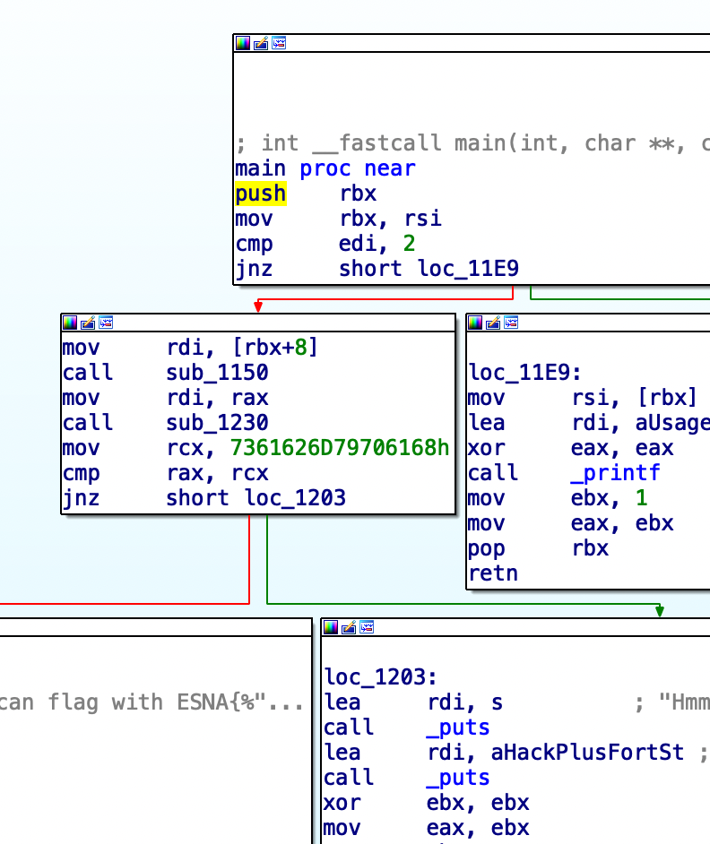
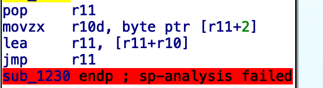

# Les Bools de la mère Noel


    Difficulty : easy
    Author : deadc0de

    Description : Le Mère noel a besoin d'accéder à la salle qui contient les boules de noel pour décorer le sapin. Mais elle ne se souvient plus du code qui permet de le déverouiller... Le lutin Dallas à retrouver un prototype utilisé pour construire la porte, il en a extrait un elf et un ELF. 


## Reco 


As we can see in the IDA dissasembly, the good path is the left basic block. We can see that there is two function called `sub_1150` and `sub_1203` then a comparaison is done between `rax` and `rcx` registers. Following the state of the flag register, we get printed the flag or the `Hack Plus Fort`




## Sub_1150 aka parseInt()

There was two way to understand what is happening, with a debugger and look at the output as a function of the input, or ask ChatGPT : 
```txt 
This code snippet appears to be a function that converts a string of digits to an integer. It does this by iterating through the characters of the string, starting from the first character, and multiplying the current result by 10 each time, before adding the integer value of the current character to the result. The integer value of a digit character is obtained by subtracting 48 from its ASCII value.

The function takes a single argument, a1, which is a pointer to a null-terminated string of characters. It initializes a local variable v1 with the value of the first character in the string, and then checks if v1 is non-zero (i.e., if the string is not empty). If the string is not empty, it initializes another local variable, v2, with the address of the second character in the string, and a result variable with the value 0. It then enters a loop, which continues as long as v1 is a digit (i.e., its ASCII value is greater than or equal to 58 and less than or equal to 96).

Inside the loop, the function calculates a new result by adding 10 times the current result to the integer value of the current character. It then updates v1 with the value of the next character in the string, using v2 as an index, and increments v2. If v1 is now zero (i.e., if the end of the string has been reached), the function returns the result. If the end of the string has not been reached, the loop continues.

If the string is empty, or if the first character of the string is not a digit, the function simply returns 0.
```


## sub_1230() aka Static analysis is dead.


This function is obfuscated, preventing the static approach with an unpacker/decompiler. 





This is the cause of the indirect branch that comes from the jmp r11 (An indirect jump uses the value stored in the specified location as the destination address.) 


There is two way to do this, using `step-i` in a debugger. 
Or using a concolic execution framework. 

## Triton For The Win 

Since I'm not a tocard who's going to waste time using `step-i`, then writing down the instruction and finally creating a z3 script to solve the equation. 
I will simply use Triton, [triton-library.github.io](triton-library.github.io). 


In the following script i've just extracted the function `sub_1230()`and mapping in the triton vm the extracted assembbly. 


Since we know the input register `rdi` and the register that will contain the result of the function `rax`, We just need to symbolyze `rdi` and `rax`, following this, we just need to computes and returns a model from the symbolic constraint (here the 0x7361626d79706168)

```python
import binascii
from triton import *


def emulate(ctx, pc = 0x1000):

  for i in range(nbinst):
    opcode = ctx.getConcreteMemoryAreaValue(pc, 16) #Read max size, we dont know the size due to obfU.
    instruction = Instruction()
    
    instruction.setOpcode(opcode)
    instruction.setAddress(pc)
    ctx.processing(instruction)
    print(instruction)
    if instruction.getOpcode()== b'\xc3':
      print("[+] found RET, stopping.")
      return
    pc = ctx.getConcreteRegisterValue(ctx.registers.rip)

ctx = TritonContext() # Create a Triton Context
ctx.setArchitecture(ARCH.X86_64) # Setup the arch used for emulation

ctx.setAstRepresentationMode(AST_REPRESENTATION.PYTHON)  

for mode in [MODE.ALIGNED_MEMORY, MODE.AST_OPTIMIZATIONS, MODE.CONSTANT_FOLDING, MODE.ONLY_ON_SYMBOLIZED]:
    ctx.setMode(mode, True)

ctx.symbolizeRegister(ctx.registers.rdi) # Input is in the rdi register. 

obfu=binascii.unhexlify(b'e80300000049b813415b450fb653024f8d1c1341ffe348bf4869c7dec0000049bb480fafffeb0b4f2e4d31d274f389d81234e80300000049b813415b450fb653024f8d1c1341ffe348bf4869cfadde000049bb4889caeb0c6745484d31d274f389d8123449bb48f7d2eb0f21787d4d31d274f389d812344e3a4149bb4821c2eb0e4d44644d31d274f389d81234733b49bb4801caeb0c53237d4d31d274f389d8123449bb4801d2eb0c2630214d31d274f389d8123449bb4831c1eb0f2f576e4d31d274f389d812344d207949bb4889c8eb0c412e7b4d31d274f389d8123449bb48f7d0eb0f354f324d31d274f389d8123437223949bb4821d0eb0e5e2f564d31d274f389d812346a7549bb4801c0eb0c447c5c4d31d274f389d8123449bb4831d1eb0f263d594d31d274f389d812342a6c7d49bb4829c8eb0e416a6f4d31d274f389d812342d4949bbc390eb0e796b32774d31d274f389d812346d')
# extract te function with IDA or LIEF, or a hex editor...


pc = 0x1000 # set rip register virtual adress
ctx.setConcreteMemoryAreaValue(pc,obfu) # map the triton vm with the extracted function 


emulate(ctx,pc)
rax = ctx.getSymbolicRegister(ctx.registers.rax) # rax 
print(ctx.getModel(rax.getAst() == 0x7361626d79706168))

print(int("0x322053c49c8c75b4",base=16))
```


## Obfuscation technique used 


- X86 Overlapping Instruction, and Mixed Boolean Arithmetic
